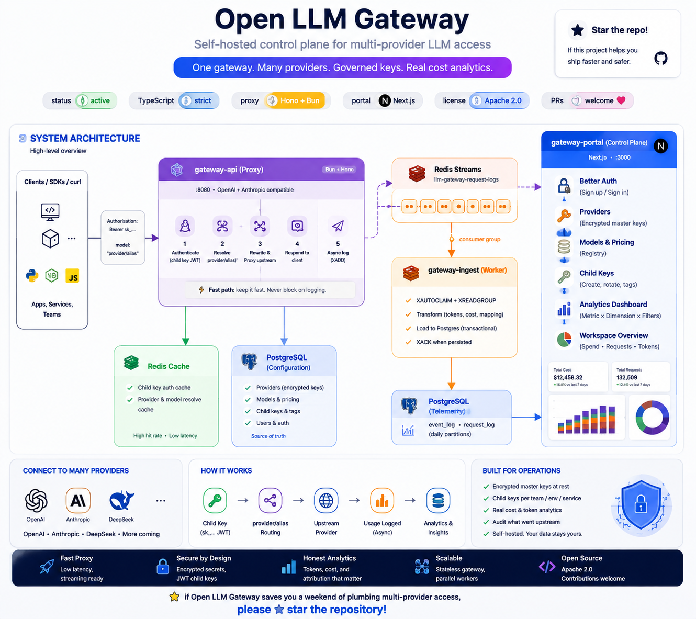
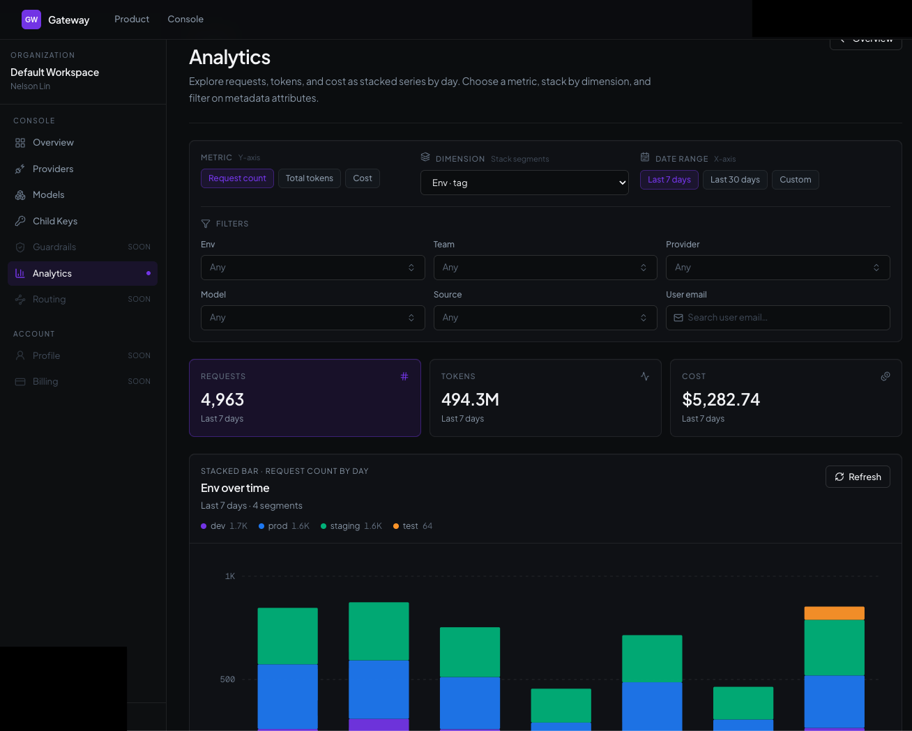

# Open LLM Gateway

### Self-hosted control plane for multi-provider LLM access

<p align="center">
  <strong>One gateway. Many providers. Org-scoped keys. Real cost analytics.</strong>
</p>

<p align="center">
  <a href="#features"></a>
  <a href="#tech-stack"></a>
  <a href="apps/gateway-api"></a>
  <a href="apps/gateway-portal"></a>
  <a href="#license"></a>
  <a href="#contributing"></a>
</p>

<p align="center">
  
</p>

Open LLM Gateway sits between your applications and upstream model providers. It gives you a **single place** to manage credentials, issue scoped child API keys, route by model alias, stream request telemetry, and explore spend — without shipping master provider keys to every teammate or microservice.

> **Star this repo** if you care about self-hosted LLM governance, multi-provider routing, and honest usage analytics. Stars help others discover the project.

---

## Why teams use this

| Pain | Open LLM Gateway |
| ---- | ---------------- |
| Master API keys scattered across services | Encrypt master keys once; issue **child keys** to apps & teams |
| Different SDKs / base URLs per vendor | Unified **OpenAI-compatible** + **Anthropic** proxy surfaces |
| No ownership of tokens or cost | Model pricing, key tags, and **stacked analytics** by provider / model / tags |
| Hard to audit what went upstream | Async Redis Stream logs → Postgres `event_log` with tokens & cost |
| SaaS gateways lock you in | **Self-hosted**, open source, your data stays in your VPC |
| Shared keys across teams | **Organizations** isolate providers, models, keys, and analytics |

If you want something between a raw reverse proxy and a full SaaS gateway (OpenRouter / Helicone-style control), this is the open middle ground.

---

## Features

### Gateway API — high-performance proxy
- OpenAI-compatible routes: `POST /openai/*`, `GET /openai/v1/models`
- Anthropic Messages routes: `POST /anthropic/*`, `GET /anthropic/v1/models`
- Model routing via `provider/alias` (e.g. `deepseek/chat`), resolved **inside the child key’s organization**
- Child key auth: `Authorization: Bearer sk_…`
- Streaming SSE pass-through
- Default per-key RPM rate limit (Redis; fail-open if Redis is down)
- Best-effort Redis Stream request logs (never blocks the client)
- Health: `GET /health` · readiness: `GET /ready` (Postgres + Redis)

### Portal — admin control plane
- Better Auth: email/password (verification required) and optional Google OAuth
- **Organizations** with roles: `root` · `admin` · `viewer` · `member`
- Invite members by email; accept at `/accept-invitation`
- Provider management with **built-in presets** (OpenAI, Anthropic, DeepSeek, xAI, Groq, and other OpenAI- or Anthropic-compatible hosts)
- Encrypted master keys; OpenAI or Anthropic compatibility
- Model registry with input / output / cache pricing
- Child key lifecycle (create, rotate, reveal, tags, enable/disable)
- **Live analytics dashboard** — stacked bars by day, metric × dimension × filters, scoped to the org
- Workspace overview with real spend / requests / tokens

### Ingest worker — durable telemetry
- Cloudflare Worker `scheduled()` Cron drain (default: every minute)
- Redis Stream consumer group (`XAUTOCLAIM` + `XREADGROUP`)
- Transform → token/cost calculation → Postgres load
- Daily range partitions plus per-org list leaves for `event_log` / `request_log`
- Mock seed scripts for local analytics demos

---

## Architecture

```
   Apps / SDKs / curl
           │  Bearer sk_<child_key>
           ▼
   ┌───────────────────┐
   │   gateway-api     │  Hono · Cloudflare Worker
   │   :8080           │  OpenAI + Anthropic proxy
   └─────────┬─────────┘
             │ XADD (async)
             ▼
        Redis Streams  ·  Redis cache (auth / model resolve / RPM)
             │
             │ consumer group · Cron scheduled()
             ▼
   ┌───────────────────┐
   │  gateway-ingest   │  transform · cost · load
   └─────────┬─────────┘
             ▼
         PostgreSQL
      event_log · request_log  (daily × org partitions)
             ▲
   ┌─────────┴─────────┐
   │  gateway-portal   │  Next.js · Drizzle · Better Auth
   │  :3000            │  orgs · providers · keys · analytics
   └───────────────────┘
```

| App | Role | Port | Runtime |
| --- | ---- | ---- | ------- |
| [`gateway-api`](./apps/gateway-api) | LLM proxy | `8080` | Cloudflare Worker (Hono) |
| [`gateway-portal`](./apps/gateway-portal) | Admin UI + schema owner | `3000` | Next.js |
| [`gateway-ingest`](./apps/gateway-ingest) | Stream → Postgres | `8081` (dev) | Cloudflare Worker (`scheduled()`) |

---

## Quick start

### Prerequisites

- **Node.js** 20+ (portal)
- **[Bun](https://bun.sh)** ≥ 1.1 (api + ingest)
- **PostgreSQL** (local Docker, Neon, or any Postgres 16+)
- **Redis over HTTP** for the Workers ([Upstash](https://upstash.com) REST). TCP Redis from `docker compose` is enough for portal cache invalidation, not for `gateway-api` / `gateway-ingest` on workerd.
- **AWS SES** (or compatible credentials) for portal verification and invitation email

### 0. Local Postgres

```bash
cp .env.example .env   # then fill secrets; share this file into each app directory or export the vars
docker compose up -d postgres
```

Copy the same `DATABASE_URL`, `JWT_SIGNING_SECRET`, and `API_ENCRYPT_KEY` into `apps/gateway-portal/.env`, `apps/gateway-api/.env`, and `apps/gateway-ingest/.env`. Workers load `.env` via `wrangler dev`.

### 1. Portal (control plane)

```bash
cd apps/gateway-portal
npm install
npm run migrate
npm run dev
```

Open [http://localhost:3000](http://localhost:3000) → **sign up** (verify email) or **Continue with Google**. A default organization is created for you.

Then: **Providers** → **Models** → **Child keys**. Copy the `sk_…` secret (shown once).

### 2. Gateway API (proxy)

```bash
cd apps/gateway-api
bun install
# REDIS_URL must be an Upstash URL (password is used as the REST token)
bun run dev                 # wrangler dev on http://localhost:8080
```

Proxy: [http://localhost:8080](http://localhost:8080)

### 3. Ingest (telemetry)

```bash
cd apps/gateway-ingest
bun install
bun run dev                 # wrangler dev --test-scheduled on http://localhost:8081
curl "http://localhost:8081/__scheduled?cron=*+*+*+*+*"
```

Optional demo data for analytics (Bun CLI, not the Worker):

```bash
bun run seed:event-log
```

### 4. Call the gateway

```bash
curl -s http://localhost:8080/health
curl -s http://localhost:8080/ready

curl -s http://localhost:8080/openai/v1/chat/completions \
  -H "Authorization: Bearer sk_YOUR_CHILD_KEY" \
  -H "Content-Type: application/json" \
  -d '{
    "model": "openai/your-model-alias",
    "messages": [{"role": "user", "content": "Hello from Open LLM Gateway"}],
    "stream": false
  }'
```

**Model string format:** `providerName/modelAlias`  
Provider name matches the portal row in **that organization**; alias maps to the upstream model id.

List models the child key can use:

```bash
curl -s http://localhost:8080/openai/v1/models \
  -H "Authorization: Bearer sk_YOUR_CHILD_KEY"
```

---

## Environment (shared secrets)

Share crypto secrets between **portal** and **gateway-api** so child keys and provider keys decrypt correctly. Root [`.env.example`](./.env.example) lists the common keys.

| Variable | Used by | Purpose |
| -------- | ------- | ------- |
| `DATABASE_URL` | all | Postgres (Neon / Drizzle) |
| `JWT_SIGNING_SECRET` | portal + api | Signs / verifies child API key JWTs (≥ 32 chars) |
| `API_ENCRYPT_KEY` | portal + api | AES key for provider + child-key ciphertext (≥ 16 chars) |
| `REDIS_URL` | all | Upstash `rediss://` URL for Workers; TCP URL is enough for portal cache |
| `UPSTASH_REDIS_REST_URL` / `UPSTASH_REDIS_REST_TOKEN` | api + ingest | Optional explicit REST credentials instead of deriving from `REDIS_URL` |

### Portal

| Variable | Purpose |
| -------- | ------- |
| `BETTER_AUTH_URL` | Public portal origin (OAuth callback base) |
| `BETTER_AUTH_SECRET` | Session secret |
| `BETTER_AUTH_TRUSTED_ORIGINS` | Comma-separated extra origins |
| `EMAIL_FROM` | Verified SES From address (required for email/password verification + invites) |
| `AWS_REGION` / `AWS_ACCESS_KEY_ID` / `AWS_SECRET_ACCESS_KEY` | SES send |
| `GOOGLE_CLIENT_ID` / `GOOGLE_CLIENT_SECRET` | Optional Google login |
| `NEXT_PUBLIC_PROXY_API_URL` | Portal “test model” calls (default `http://localhost:8080`) |

### Gateway API (`wrangler.jsonc` vars + secrets)

| Variable | Default | Purpose |
| -------- | ------- | ------- |
| `PORT` | `8080` | Local listen port |
| `REQUEST_BODY_LIMIT_BYTES` | `1048576` | Max proxy body |
| `UPSTREAM_TIMEOUT_MS` | `120000` | Upstream fetch timeout |
| `CHILD_KEY_RATE_LIMIT_RPM` | `600` | Default RPM per child key (`0` disables) |
| `GATEWAY_CORS_ORIGINS` | *(empty)* | Comma-separated CORS allowlist; empty disables CORS |
| `REQUEST_LOG_STREAM_MAXLEN` | `10000` | Approximate Redis Stream cap (`XADD MAXLEN ~`) |

### Ingest (`wrangler.jsonc` vars)

| Variable | Default | Purpose |
| -------- | ------- | ------- |
| `REQUEST_LOG_STREAM` | `llm-gateway-request-logs` | Stream key |
| `REQUEST_LOG_CONSUMER_GROUP` | `gateway-ingest` | Consumer group |
| `REQUEST_LOG_READ_COUNT` | `20` | Batch size |
| `REQUEST_LOG_BLOCK_MS` | `0` | Must stay `0` on Upstash REST |
| `REQUEST_LOG_CLAIM_MIN_IDLE_MS` | `30000` | Reclaim stuck PEL entries |
| `REQUEST_LOG_IDLE_EXIT_MS` / `REQUEST_LOG_MAX_DURATION_MS` | `30000` / `60000` | End a cron drain so the next tick can continue |

> Never commit `.env` / `.dev.vars` files. Treat `sk_…` child keys like passwords.

---

## How routing works

```
POST /openai/v1/chat/completions
Authorization: Bearer sk_…
{ "model": "deepseek/chat", ... }
        │
        ▼
 verify child key JWT → load key row (org id)
        │
        ▼
 resolve provider "deepseek" + alias "chat" in that organization
        │
        ▼
 POST https://api.deepseek.com/v1/chat/completions
 Authorization: Bearer <decrypted master key>
 { "model": "<upstream model id>", ... }
```

1. Client authenticates with a **child key** belonging to one organization.
2. Body includes `model: "provider/alias"`.
3. Gateway resolves an **active** provider + model in that org (Postgres, Redis-cached).
4. Request is rewritten and forwarded with the **master** provider key.
5. Response returns to the client; a log event is emitted to Redis (best-effort).
6. Optional client `metadata` is stripped before the upstream call and stored on the request log for analytics filters.

---

## Organizations and roles

New users get a default organization. Root and admin members can create more orgs and invite people.

| Role | Can do |
| ---- | ------ |
| **root** | Full access, including deleting the organization and members |
| **admin** | Manage providers, models, keys, and members; cannot delete the org |
| **viewer** | Read-only |
| **member** | View org, providers, and models; **cannot** view or manage child keys |

Console routes are org-scoped: `/org/<organizationId>/{providers,models,child-keys,analytics}`.

---

## Analytics at a glance

The portal analytics surface is built for real operations teams. Series are **always filtered to the active organization**.

<p align="center">
  
</p>

| Control | What it does |
| ------- | ------------ |
| **Metric** | Y-axis: request count · total tokens · cost |
| **Dimension** | Stack segments: provider · model · user · metadata / tag fields (`env`, `team`, …) |
| **Filters** | Multi-select dropdowns + user-email autocomplete |
| **Date range** | Last 7 / 30 days or custom |

Workspace overview cards reuse the same query layer for spend-by-provider, requests, and tokens.

---

## Repository layout

```
llm-gateway/
├── apps/
│   ├── gateway-api/       # Hono proxy (Cloudflare Worker)
│   ├── gateway-portal/    # Next.js admin + analytics + schema owner
│   └── gateway-ingest/    # Redis Stream → Postgres Cron Worker
├── docker-compose.yml     # Local Postgres (+ optional TCP Redis)
├── .env.example
├── PROJECT.MD             # Product vision
├── SYSTEM_DESIGN.MD       # Target architecture
└── README.MD              # You are here
```

Each app has its own `package.json`, tests, and `tasks/` work logs.

---

## Development

```bash
# API
cd apps/gateway-api && bun test && bun run build

# Portal
cd apps/gateway-portal && npm test && npm run lint && npm run build

# Ingest
cd apps/gateway-ingest && bun test && bun run build
```

Live proxy smoke tests (need real upstream keys and a configured org provider/model/child key):

```bash
cd apps/gateway-api
bun run test:openai-chat
bun run test:anthropic-messages
```

Portal schema changes: edit `apps/gateway-portal/lib/db/schema.ts` → `npm run generate` → `npm run migrate`. The portal owns migrations; api and ingest only read/insert.

---

## Tech stack

| Layer | Stack |
| ----- | ----- |
| Proxy | [Hono](https://hono.dev), Cloudflare Workers, TypeScript, [@upstash/redis](https://github.com/upstash/redis-js) |
| Portal | Next.js App Router, Better Auth (organization plugin), shadcn/ui, Tailwind, Drizzle |
| Ingest | Cloudflare Workers Cron, Redis Streams, Drizzle, Postgres partitions |
| Data | PostgreSQL · Redis (cache + streams) |
| Crypto | `jose` (JWT child keys) · AES-GCM at rest |

---

## Roadmap

- [x] Multi-provider proxy (OpenAI + Anthropic surfaces)
- [x] Encrypted providers + child keys
- [x] Redis Stream logging + ingest worker
- [x] Cost / token analytics dashboard
- [x] Multi-tenant organizations + RBAC
- [x] Default per-key RPM rate limits
- [ ] Portal UI for per-key RPM / monthly budgets (columns exist; budget is not enforced yet)
- [ ] Policy / guardrails middleware
- [ ] Unified `/v1` OpenAI surface
- [ ] Broader provider coverage & fallbacks
- [ ] Audit log explorer (mutations already write `audit_log`)

See [`PROJECT.MD`](./PROJECT.MD) and [`SYSTEM_DESIGN.MD`](./SYSTEM_DESIGN.MD) for the full vision.

---

## Contributing

Contributions make this project better for everyone.

1. **Star** the repo (seriously — it helps discovery).
2. Fork → feature branch → focused PR.
3. Add tests for auth, routing, payload transforms, and logging changes.
4. Run the app’s test suite before opening a PR.
5. Never commit secrets, live keys, or production env files.

Bug reports, provider requests, and design discussions are all welcome.

---

## Security

- Master provider keys are **encrypted at rest** and never returned to proxy clients.
- Child keys on the wire are plain `sk_…` JWTs; the DB stores **ciphertext only**.
- Providers, models, keys, and analytics are **organization-scoped**.
- Admin mutations write an `audit_log` row; portal responses do not leak internal errors.
- Rate limiting fails **open** if Redis is unavailable so the proxy keeps serving traffic.
- Rotate `JWT_SIGNING_SECRET` / `API_ENCRYPT_KEY` carefully — both portal and api must stay in sync.

Found a vulnerability? Report it privately to the maintainers — please do not open a public issue with exploit details.

---

## License

This project is licensed under the [Apache License, Version 2.0](./LICENSE).

```text
Copyright 2026 Open LLM Gateway contributors

Licensed under the Apache License, Version 2.0 (the "License");
you may not use this file except in compliance with the License.
You may obtain a copy of the License at

    http://www.apache.org/licenses/LICENSE-2.0

Unless required by applicable law or agreed to in writing, software
distributed under the License is distributed on an "AS IS" BASIS,
WITHOUT WARRANTIES OR CONDITIONS OF ANY KIND, either express or implied.
See the License for the specific language governing permissions and
limitations under the License.
```

---

## Docs

| Doc | Description |
| --- | ----------- |
| [`apps/gateway-api`](./apps/gateway-api) | Proxy service README |
| [`apps/gateway-portal`](./apps/gateway-portal) | Admin portal README |
| [`apps/gateway-ingest`](./apps/gateway-ingest) | Ingest worker README |
| [`PROJECT.MD`](./PROJECT.MD) | Product vision |
| [`SYSTEM_DESIGN.MD`](./SYSTEM_DESIGN.MD) | Architecture notes |

---

<p align="center">
  <strong>Open LLM Gateway</strong> — one gateway, many providers, governed keys, observable spend.<br />
  If this saves you a weekend of plumbing multi-provider LLM access, please <strong>★ star the repo</strong>.
</p>
